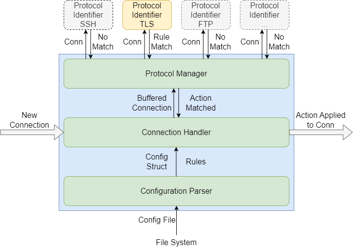

### University of Colorado, Boulder
### CSCI-ECEN 5273 Network Systems

<br><br>

# Milestone Report <br><br> Passthru - A TCP Connection De-multiplexer

## Team Members

- Gaukas Wang <[gaukas.wang@colorado.edu](mailto:gaukas.wang@colorado.edu)>
- Parker Morr <[pamo0131@colorado.edu](mailto:pamo0131@colorado.edu)>
- Sharon Moses Jangam <[shja8214@colorado.edu](mailto:shja8214@colorado.edu)>

## Current Progress

To make sure we are making good progress on the project, we have implemented a roadmap for the project: 
- `handler` package: 
    - [x] Connection Handler: `handler.Server` struct (Oct 19)
    - [x] Accept all incoming connections on the address it is listening on
    - [x] Redirect the incoming connection to write to a buffer to be inspected by all protocol filters
    - [x] According to feedback from protocol filters, forward the connection to the destination server
    - [ ] Error logging/handling
- `protocol` package:
    - [x] Connection Inspection Buffer: `protocol.ConnBuf` struct (Oct 9)
    - [x] Protocol Identifier Manager: `protocol.ProtocolManager` struct (Oct 17)
    - [x] Custom Protocol Identifier Interface: `protocol.Protocol` interface (Oct 9)
    - [x] Example Protocol Identifier: `protocol/tls.Protocol` struct (Oct 17)
- `config` package:
    - [x] Configuration Parser: `config.Config` struct (Oct 22)
- `cmd/passthru` main program: (Planned: by Nov 18)
    - [ ] Parse configuration file into a `config.Config` struct
    - [ ] Create all `handler.Server`s
    - [ ] Load configuration into all servers' protocol managers
    - [ ] Start all servers
    - [ ] Loggings

All features marked as completed are already merged into the `master` branch of the project repository and have proper unit tests implemented and passed.

## Recap: Concept and Design

### Concept: A TCP Connection De-multiplexer

Passthru is a TCP connection de-multiplexer that operates at Layer-4. It is capable of identifying parameters of (a certain group of) TCP application protocol within incoming TCP connections by employing Deep Packet Inspection (DPI). Then it will forward the payload to the corresponding destination (a socket).

### Block Diagram



- The blue box represents the distributed `passthru` application. 
- On top there are a few pluggable protocol identifiers which does Deep Packet Inspection (DPI) on the incoming TCP connections and return the inspection result of whether the incoming connection is matching one of the rules from the config. 

### Major Components

#### Connection Handler: `handler` package

A Connection Handler is a component that accepts incoming TCP connections and 
run them through all known protocol identifiers. According to the protocol identification result, the handler will determine the destination of the connection and bidirectionally forward the connection to the destination.

#### Protocol Manager: `protocol` package

A Protocol Manager is a component that manages all protocol identifiers. It is responsible for invoking all protocol identifiers to inspect incoming connections and determine the protocol of the connection.

#### Extension: User-defined Protocol Identifier: `protocol.Protocol` interface

Interface for Custom Protocol Identifier will be provided. By defining an interface, any developer can implement their own protocol identifier and register it with the application within their own builds. Therefore, **Passthru** could be extended to support new protocols without making any changes to the application base and 
anyone can deploy their customized version of **Passthru**.

### Configuration Parser: `config` package

A Configuration Parser is a component that parses a configuration file into a `Config` struct for later use. 

A complete config file should include: 
- Each server address to listen on 
- Protocols to be identified for each address
- Matching parameters for each protocol to be identified out of the connection
- Destination server for each parameter match

To maintain the highest flexibility and human-readability, we are opting for a JSON configuration file. 

```json
{
    "min_version": "v0.0.0",
    "servers": {
        "0.0.0.0:443": {
            "TLS": {
                "SNI gaukas.wang": {
                    "action": "FORWARD",
                    "to_addr": "gaukas.wang:443"
                },
                "SNI google.com": {
                    "action": "FORWARD",
                    "to_addr": "google.com:443"
                },
                "CATCHALL": {
                    "action": "REJECT"
                }
            },
            "SSH": {
                "CATCHALL": {
                    "action": "REJECT"
                }
            },
            "CATCHALL": {
                "CATCHALL": {
                    "action": "FORWARD",
                    "to_addr": "127.0.0.1:443"
                }
            }
        },
        "0.0.0.0:22": {
            "SSH": {
                "rules": {
                    "CATCHALL": {
                        "action": "FORWARD", 
                        "to_addr": "127.0.0.1:22122"
                    }
                }
            }            
        }
    }
}
```

