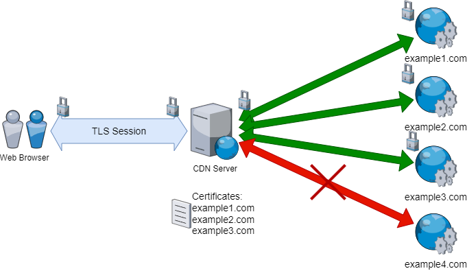
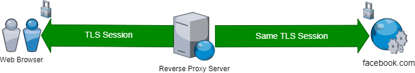
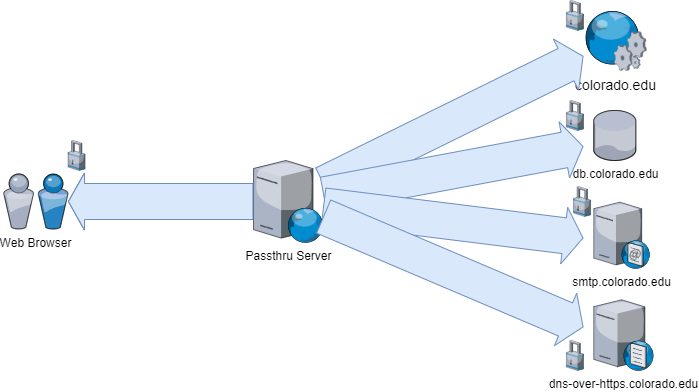

### University of Colorado, Boulder
### CSCI-ECEN 5273 Network Systems

  

# Project Definition Document    Passthru - A TCP Connection De-multiplexer

## Approvals

|  | Name | Affiliation | Approved | Date |
|---|---|---|---|---|
| Instructor | Prof. Jose Santos | CU Boulder |  |  |

## Team Members

- Gaukas Wang <[gaukas.wang@colorado.edu](mailto:gaukas.wang@colorado.edu)>
- Parker Morr <[pamo0131@colorado.edu](mailto:pamo0131@colorado.edu)>
- Sharon Moses Jangam <[shja8214@colorado.edu](mailto:shja8214@colorado.edu)>

## Project Description

### Problem and Need

Recently, there is a trend of using shared network infrasturctures, especially 
after the concept of Web3 gets more attention. To support the trend, a solution 
to increase the efficiency of the shared resource is needed. One of the most 
commonly shared network resources is the IP addresses and ports.  

To improve the sharing ratio of the IP addresses and ports, a solution to 
de-multiplex TCP connections on a single port is needed. Furthermore, the 
de-multiplexer should operates at most Layer-4 in order to watch for raw sockets.  

### Previous Work

A traditional CDN server provides only HTTPS content to the client. And to do
so, it will play the role as man-in-the-middle(MITM) to establish two TLS 
connections, one with the client and one with the origin server. To do so, 
the CDN server MUST own a valid TLS certificate and its private key issued to 
the domain it serves. This creates privacy concerns, as well as potential 
security issue given that CDN nodes could be compromised and malicious code 
could be injected into the TLS connection. 

A reverse proxy server, however, does not always need to own a valid TLS 
certificate issued to the server being proxied. Instead, it forwards all 
connectionS it received to the origin server without decrypting the TLS 
and re-encrypting it. This guarantees the privacy for the client and the 
authenticity of the origin server. The downside of this approach is obvious: 
A reverse proxy server cannot serve multiple sites on different servers 
at the same time.

### Objectives

We propose Passthru, a TCP* connection de-multiplexer that operates at Layer-4**. 

\*: UDP packets could be non-trivial to de-multiplex, since UDP packets could be fully encrypted and UDP is connectionless by its nature. 

\**: We argue that if the function is implemented at Layer-4, it is trivial to 
implement it at lower layers using existing libraries. 

#### Core Functionality

We need to build an application that can identify (a certain group of) protocols used within incoming TCP connections by inspecting the application 
data in TCP payload and forward the payload to the corresponding destination. 

#### Configuration File Support

It is not feasible to hard-code all the matching rules into the application. We 
need to support a config-file-based solution to provide enough flexibility to 
the user. The configuration file should, if at all possible, use a well-known 
syntax and be human-readable, to reduce the learning curve for the user.

#### User-defined Protocol Support

We figured it is not practical to implement identifiers for all protocols 
existing in the world, and there will be new protocols being developed in the 
future. Therefore, we will provide a user-defined protocol interface, in order 
to support the users on their own needs. By providing such interface, a user 
with enough knowledge of programming can implement their own identifier and 
integrate it into Passthru without make any changes to the application itself.

### Critical Project Components

#### Connection Handler

A Connection Handler is a component that accepts incoming TCP connections and 
run them through all known protocol identifiers. According to the result of 
the handler will determine the destination of the connection and forward the 
current and all future packets in the same connection to the destination.

#### Protocol Identifier, with customizable interface

A Protocol Identifier is a component that inspects the application data in a 
packet from a TCP connection and determine the protocol used in the connection. 
The identifier should be able to identify the protocol used in the connection 
with acceptably low false positive rate and false negative rate. 

Interface for Custom Protocol Identifier will also be provided. By defining the 
standard of the interface, a user who is a programmer can implement their own 
pluggable protocol identifier and register it with the application. Therefore, 
the application could be extended to support new protocols without making any 
changes to the application code base itself.

#### Configuration File Parser

A Configuration File Parser is a component that parses the configuration file 
and provide the information to the Connection Handler. The parser should read 
rules from the configuration file and save them in a data structure that is 
pre-defined. The parser should work with a well-known config file syntax, here 
we choose JSON, while keeping the config files human-readable for 
best user experience.